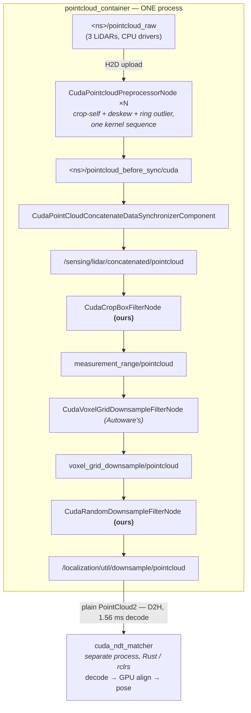

# The CUDA pipeline: what runs where, and where the copies are

Three switches select GPU or CPU for three consecutive stages. They are
independent, each is whole-stage, and none of them can be half-applied. This
document is the map, because the wiring is spread across a sensor kit launch
file, a localization launch file and a Rust package, and reconstructing it from
those takes longer than reading it here.

```bash
just launch pointcloud_backend:=cuda \
            localization_pointcloud_backend:=cuda \
            pose_source:=cuda_ndt
```

| switch | selects | default |
|---|---|---|
| `pointcloud_backend` | sensing: per-LiDAR preprocessing and concatenation | `cuda` (from `use_cuda`) |
| `localization_pointcloud_backend` | the NDT input chain: crop, voxel, random downsample | `cpu` |
| `pose_source` | the scan matcher itself | `ndt` |

---

## Data flow



Everything inside the box is one process, and that is the whole point: the five
GPU stages hand each other device pointers, not data.

## Why one container is load-bearing

`cuda_blackboard` is **not a transport**. It is a process-local singleton holding
a map from a `UInt64` instance id to a device pointer. What crosses ROS is that
integer, plus a `negotiated` handshake to agree on the type; the subscriber looks
the pointer up *in its own process*.

So a stage in a different process receives the id and finds nothing behind it.
Both sensor kits load the sensing chain into `pointcloud_container`, and
`util.launch.xml` loads the localization chain into the same one. That is not
tidiness, it is the requirement.

Two consequences worth knowing before moving anything:

- **`localization_pointcloud_backend:=cuda` on its own still works, but is not
  free.** With `pointcloud_backend:=cpu` the concatenated cloud arrives as a
  plain `PointCloud2`; `CudaBlackboardSubscriber` has a compatible-topic
  fallback, so the chain runs, paying a host-to-device copy at its first stage.
  Only both together are GPU-resident end to end.
- **Halves of one stage cannot mix.** The CUDA concatenator subscribes over the
  blackboard and needs the `pointcloud_before_sync/cuda` negotiation topic that
  only the CUDA preprocessor publishes. Feed it a CPU chain and every cloud
  arrives with a null device pointer. Autoware's own enum has no mixed mode for
  the same reason.

## Where the copies are

Two, and only two:

1. **H2D at the sensing preprocessor's input.** The drivers stay on the CPU in
   both modes — Nebula has no CUDA decoder for Velodyne, and the Seyond driver is
   a vendor CPU binary. Autoware's own `pipeline_mode:=cuda` does the same.
2. **D2H at the matcher's input.** `cuda_ndt_matcher` is an rclrs node: it cannot
   join a C++ component container and cannot read the blackboard. But
   `CudaBlackboardPublisher` also carries a `compatible_pub_` publishing a plain
   `PointCloud2`, so the chain feeds it with no change to it. That compatible
   topic is the copy, and the 1.56 ms decode on the far side.

Copy (2) is the one that keeps coming up. Removing it is not a matter of writing
a Rust `cuda_blackboard`: see
[rust-cuda-blackboard-feasibility.md](../research/localization/rust-cuda-blackboard-feasibility.md).

## Source organisation

| stage | package | language |
|---|---|---|
| sensing CUDA chain | `autoware_cuda_pointcloud_preprocessor` (installed, upstream) | C++/CUDA |
| which sensing chain runs | `src/sensor_kit/*/launch/pointcloud_preprocessor.launch.py` | launch |
| localization CUDA filters | `src/sensing/golfcart_cuda_preprocessor` | C++/CUDA |
| which localization chain runs | `cuda_ndt_matcher_launch/launch/util/util.launch.xml` | launch |
| the matcher | `cuda_ndt_matcher/src/{ndt_cuda,cuda_ffi,cuda_ndt_matcher}` | Rust |
| top-level switches | `golfcart_launch/launch/{golfcart,logging_simulation}.launch.yaml` | launch |

`golfcart_cuda_preprocessor` exists to fill two gaps upstream leaves. Autoware
ships `CudaVoxelGridDownsampleFilterNode`, but no standalone CUDA crop box — the
cropping it has is fused inside `CudaPointcloudPreprocessorNode` with distortion
correction and needs a per-point time field — and no CUDA random downsample at
all. Without both, the chain would pay a D2H before the one accelerated stage and
an H2D after it.

Inside the Rust matcher:

- `ndt_cuda` — the algorithm, cubecl kernels, GPU scoring and the Newton solve
- `cuda_ffi` — CUB radix sort and the spatial hash, built by `nvcc`
- `cuda_ndt_matcher` — the ROS node, callbacks, publishing, diagnostics

## The language boundary is the architectural fact

Stages 1–5 are C++/CUDA in one container. Stage 6 is Rust in its own process.
Every remaining question about zero-copy on this path is a question about that
boundary, not about CUDA.

## What is measured, and what is not

| | |
|---|---|
| `pointcloud_backend:=cuda` | measured on the Orin: −23.7 points of container CPU, +33 points of GPU, +465 mW, equal throughput. See [the Orin handover](../handover/2026-08-30-cuda-ndt-on-orin.md). |
| `localization_pointcloud_backend:=cuda` | **correctness verified, speed never measured.** The CPU chain is ~19% of a core; the CUDA one has not been timed and could be slower. See [phase 5](../roadmaps/5-gpu-localization-preprocessing.md). |
| `pose_source:=cuda_ndt` | measured: 30.7 ms per frame against Autoware's 47.0, 3 cm RMSE, 9.0 s initialisation. |
