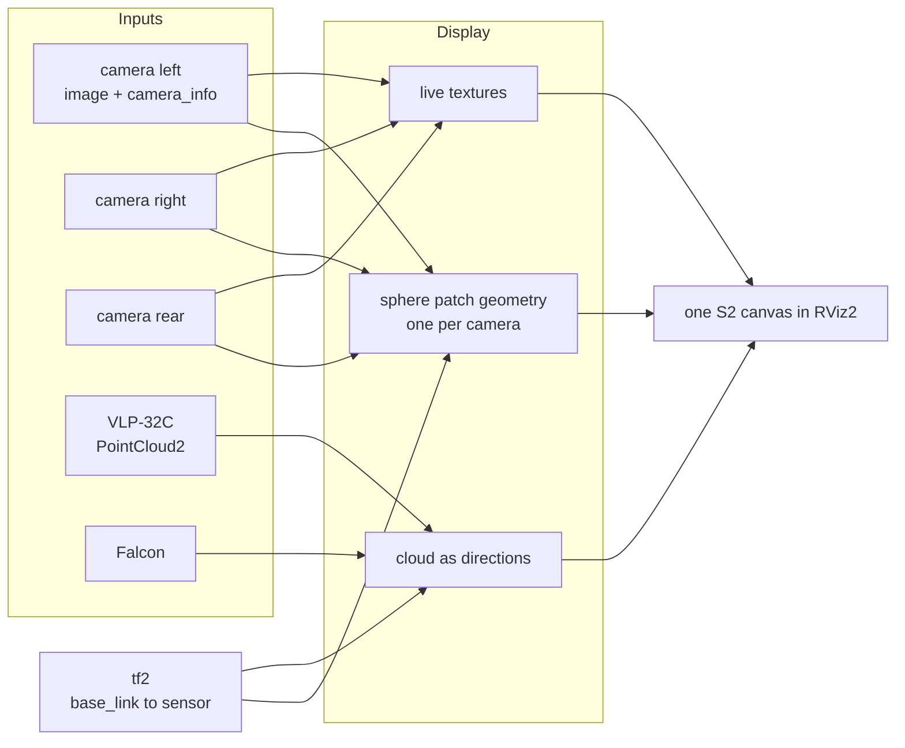
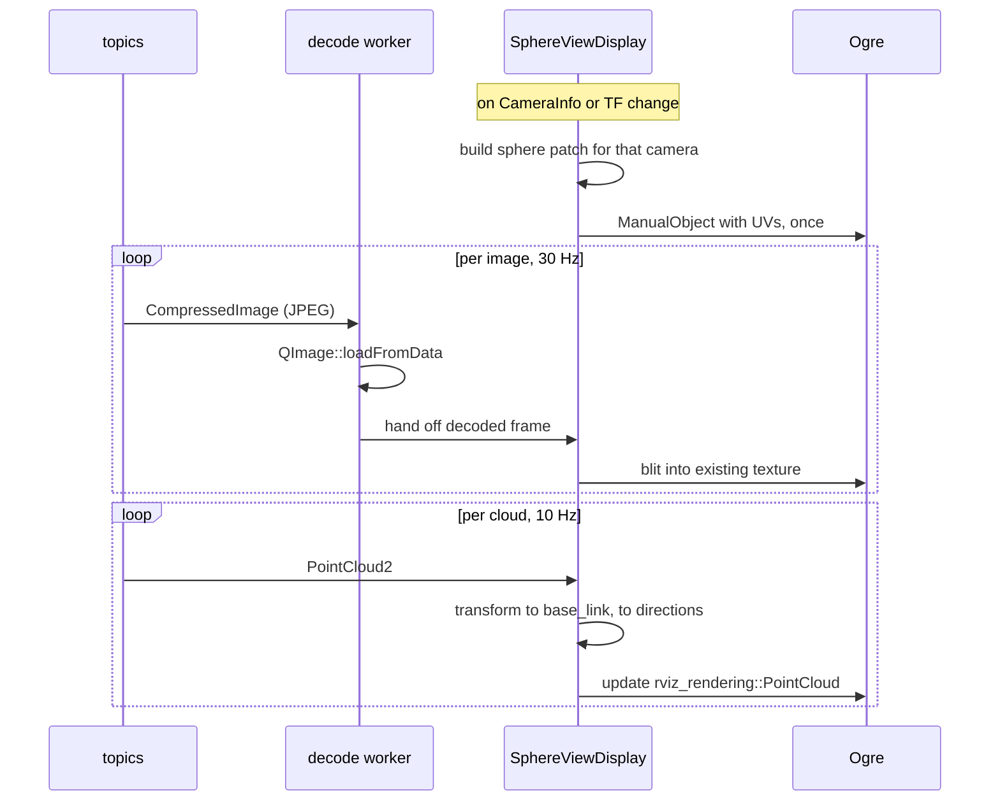
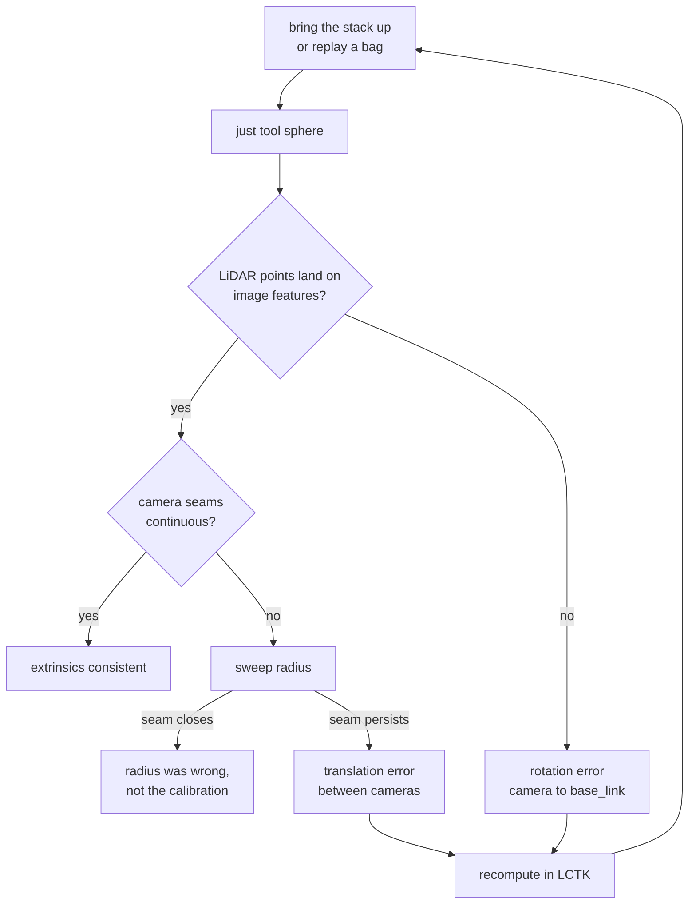

# Spherical Sensor View — design

A live RViz2 display that paints every camera image and every LiDAR return onto
one sphere centred on `base_link`, so that a wrong extrinsic becomes something
you can see rather than something you compute.

Status: proposed, 2026-08-24. Nothing implemented.
Phase doc: [5-sphere-sensor-view.md](../roadmaps/5-sphere-sensor-view.md).

## Scope

**This package renders. It does not calibrate.**

[LCTK](https://github.com/NEWSLabNTU/LCTK) computes the extrinsics. This is an
Autoware-side package that subscribes to live topics, applies the transforms
that are already published on `/tf_static`, and draws the result. It has no
optimiser, no target detection, no parameter output, and no file it writes.

The boundary is worth stating because a viewer that also nudges parameters is a
different and much larger program, and because the value here comes precisely
from being downstream: it consumes the calibration the running system is
actually using, not a file that is meant to describe it.

Related: [Phase 3A camera calibration](../roadmaps/3-indoor-a-camera-calibration.md),
whose output this tool checks.

---

## The idea

Every sensor on the vehicle measures directions. A camera pixel is a direction
plus a colour; a LiDAR return is a direction plus a range. If the extrinsics are
right, two sensors looking at the same physical feature report the **same
direction** from `base_link`. If an extrinsic is wrong, they disagree, and the
disagreement has a shape: a rotation error slides the whole image against the
cloud, a translation error slides near objects more than far ones.

Projecting everything onto one sphere makes that comparison direct. The check
needs no ground truth, no target, and no measurement — only the observation that
two sensors should agree.



---

## Architecture

One package, one RViz2 display plugin. No extra nodes: the display subscribes
directly, because a separate node would add a serialisation hop for image data
that is already the largest thing in the system.

```
golfcart_sphere_view/
  src/
    textured_patch.{hpp,cpp}     vendored from nobleo/rviz_satellite, Apache-2.0
    sphere_mesh.{hpp,cpp}        direction grid, camera patch extraction
    camera_layer.{hpp,cpp}       one camera: sub, decode, texture, patch
    cloud_layer.{hpp,cpp}        one LiDAR: sub, directions, colouring
    sphere_view_display.{hpp,cpp}  rviz_common::Display, owns the layers
  plugin_description.xml
```

### Why `rviz_common::Display` and not `RosTopicDisplay`

`RosTopicDisplay<T>` binds a display to exactly one topic. This tool needs three
images, three `CameraInfo`, and two clouds on one canvas, so it derives from
`Display` and manages its own subscriptions. This is the one structural place
where `rviz_satellite` cannot be followed — its `AerialMapDisplay` is
`RosTopicDisplay<NavSatFix>`.

### What comes from rviz_satellite

`tile_object.{hpp,cpp}` is 274 lines with no coupling to anything geographic: it
is a material, a dynamic texture fed from a `QImage`, and an
`Ogre::ManualObject`. Only its 23-line quad builder is specific to maps. Vendor
it as `textured_patch`, replace the quad builder with the sphere-patch builder,
keep the material configuration — `createMaterialWithNoLighting`,
`CULL_NONE`, depth-write off — which is already what a sphere viewed from inside
needs.

One change on the way in: `TileObject::updateData` destroys and recreates the
Ogre texture on every update. That is fine for map tiles, which change when the
vehicle drives a block. Three cameras at 30 Hz would make ninety texture
allocations a second. Create the texture once with `createManual` and blit into
its `HardwarePixelBuffer` afterwards.

---

## The geometry, and the one honest limitation

The sphere is a fixed direction grid — latitude/longitude, roughly 1° spacing —
centred on `base_link`. For each camera, each grid direction is transformed into
the camera's optical frame, kept if it is in front of the image plane, projected
through `K` and the distortion model, and kept if it lands inside the image.
Surviving vertices carry the texture coordinate; triangles with three surviving
vertices form that camera's patch.

**This geometry is a function of `CameraInfo` and TF only.** Both are static
while the vehicle runs, so the patches are built once and rebuilt only when
either changes. Per frame, nothing happens except a texture upload. That is what
makes a live tool affordable.

### Radius is not a cosmetic setting

A sphere has one radius; the world does not. A camera ray is painted onto the
sphere at radius `R`, which is exactly correct only for scene features actually
at distance `R`. Nearer or farther features land in the wrong place, and two
cameras with different centres disagree about *where* — the seam between them
opens up.

This is the bowl-model problem from surround-view stitching, and it is a real
limitation, not a bug to fix later. Three consequences:

1. **Radius must be a live property**, adjustable while watching. Sweeping it is
   informative: features align when `R` matches their true depth, which is a
   crude depth read-out and a good sanity check by itself.
2. **Rotation errors are visible at any radius.** They move everything in the
   same direction regardless of depth. This is what the tool is good at.
3. **Translation errors masquerade as radius errors.** A camera mounted 20 cm
   from where TF says it is looks like a scene at the wrong depth. Distinguishing
   the two needs the LiDAR, whose points carry true range.

A later refinement is an adaptive shell: use LiDAR range per direction instead of
a constant `R`. That removes the parallax entirely and turns the sphere into a
coarse depth map. It is deliberately out of scope for the first version, because
it couples the two sensor families the tool is supposed to compare independently.

### The two cloud modes

| Mode | Point placement | Answers |
|---|---|---|
| `angular` | snapped to radius `R` | Do camera and LiDAR agree on **direction**? Pure rotation test, parallax removed. |
| `metric` | true range | Where does the cloud actually sit relative to the painted image? Exposes translation, at the cost of the sphere no longer being a sphere. |

Start in `angular`. It answers the question the tool exists for, with no
confounds.

---

## Data flow



JPEG decoding must not happen on the render thread. The cameras publish
`image_raw/compressed` only, so every frame needs a decode; doing that inline
would stall RViz's frame loop. One worker thread per camera, with the newest
decoded frame handed over and older ones dropped — this is a monitor, so
dropping is correct.

---

## Inputs on this vehicle

| Layer | Topic | Frame |
|---|---|---|
| camera left | `/sensing/camera/left/image_raw/compressed` + `/camera_info` | `camera_left` |
| camera right | `/sensing/camera/right/image_raw/compressed` + `/camera_info` | `camera_right` |
| camera rear | `/sensing/camera/rear/image_raw/compressed` + `/camera_info` | `camera_rear` |
| ZED (orin) | `/sensing/camera/zed/rgb/color/rect/image/compressed` | `zed_left_camera_frame_optical` |
| VLP-32C | `/sensing/lidar/vlp32/velodyne_points` | `velodyne` |
| Falcon | `/sensing/lidar/falcon/iv_points` | `seyond` |

Cameras and their `camera_info` are configured, not hardcoded, so the same
display serves the ZED on the orin and the three GMSL cameras on the Advantech.

---

## Workflow



The tool is **read-only**, by design and not by omission. LCTK estimates; this
renders what the running system believes. What it adds is the step on either
side of that: seeing that a calibration is wrong, and confirming that a new one
is right, against live sensors rather than against the calibration dataset that
produced it.

A concrete first session, once phase 3A's calibration lands:

1. Park where the LiDAR sees structure with visual texture — a building edge, a
   doorway, parked cars.
2. Open the display with only `camera_left` and the VLP-32C enabled.
3. Set radius to roughly the distance of that structure.
4. Look at whether the depth discontinuity in the cloud sits on the visual edge.
5. Enable `camera_right`; look at the seam.
6. Repeat for the rear camera and the Falcon.

---

## Phases

| Phase | Deliverable | Proves |
|---|---|---|
| S1 | `textured_patch` vendored, one hardcoded camera on a sphere patch | the Ogre path works in RViz2 |
| S2 | configurable camera list, decode workers, live radius | three cameras and their seams |
| S3 | cloud layers, `angular` and `metric` modes, colour by intensity or range | the actual check |
| S4 | `just tool sphere` recipe, saved RViz config, docs | somebody else can run it |

S1 is the risk: if dynamic textures on `ManualObject` geometry misbehave inside
RViz2's render loop, that is better found in a day than after the projection
maths is written.

---

## Risks

**The calibration this tool verifies is currently wrong in a way that will
dominate what it shows.** Phase 3A found one calibration cloned across three
cameras, at a resolution that does not match the declared one — a systematic
~14° bearing error. Built today, the tool would faithfully render nonsense.
That is an argument for building it, but the first honest picture needs 3A's
recalibration to land first.

**The distortion model must be applied exactly.** The camera files declare
`rational_polynomial` with all four rational coefficients zero and the
thin-prism terms carrying the values. Whatever the resolution of that, the
projection code has to use the same convention as the driver, or the tool
invents error that is not there. Reuse Autoware's
`autoware_image_projection_based_fusion` maths rather than re-deriving it.

**Frame conventions.** Camera projection happens in the optical frame, and the
sensor kit has no `*_optical_link` frames — a known 3A blocker. Until those
exist, the transform chain is off by the body-to-optical rotation, and the tool
will show a ~90° error that is real but is in the URDF, not the calibration.

**Render thread stalls.** Covered above: decode off-thread, texture blit rather
than reallocate, geometry rebuilt only on `CameraInfo` or TF change.

---

## What the first real dataset changed

S1 to S4 were built and verified against synthetic sensors. Autoware's Leo
Drive bags were the first data the display had not also generated, and they
falsified four things at once. Recorded here because each was a *reasonable*
assumption, and the pattern is worth carrying into the next phase: every one was
a case of trusting a name or a model past where it was earned.

**A frame called `*_optical_link` need not be the optical frame.** These bags
publish both `camera_left/camera_link` and `camera_left/camera_optical_link`,
and it is the first that satisfies the optical convention. Believing the name
rolled every image ninety degrees. The check is three lines of arithmetic --
transform the optical axes into the vehicle frame, confirm image-down points
down -- and it should be run against any new rig before anything else.

**A distortion polynomial lies outside its fitted range.** On these cameras it
turns over near 60 degrees off axis, so rays at 65 degrees project back to
plausible pixels inside the frame. The sphere took a band of texture sampled
from somewhere the camera never looked -- and unlike a gap, that looks like
data. The display now bounds each model at its own turnover.

**Parallax at the seams is larger than intuition suggests.** These cameras are
2.08 m apart. At radius 12 a feature at 5 m lands 13.8 degrees adrift between
front and left; at 40 m, 6.8 degrees. The vehicle this is being built for has
baselines of centimetres, so the seams there will be far smaller -- but the
lesson is that the bowl model's error scales with baseline, and it is the
binding constraint on stitching for anything longer than a car.

**Zero at the radius is the self-check worth keeping.** Two cameras painting a
feature that sits exactly on the sphere must paint it in the same place. That
the measured disagreement is 0.00 degrees at exactly the sphere radius is what
tells you the transform composition is right, independent of any picture.

## Where this can go next

Four candidates, in the order their value per unit of effort suggests. None is
started, and S1 to S4 are enough to be useful without any of them.

### A -- Colour the cloud from the cameras, instead of the sphere

Project each LiDAR return into whichever cameras contain it and colour the point
with that pixel. Every return carries its true range, so there is no bowl and no
parallax at all: a wrong extrinsic shows as colour bleeding across depth
discontinuities, tree colour smeared onto the road behind it.

This is the classic LiDAR-camera check, it reuses `projectToPixel` and
`CloudLayer` almost unchanged, and it answers the alignment question exactly
where the sphere can only approximate. Its limit is the opposite of the sphere's:
it says nothing about directions the LiDAR does not sample, and a 32-plane
scanner samples vertically rather sparsely.

The two are complements, which is the argument for having both. Small to medium
effort, and the highest value here.

### B -- Report the disagreement as a number

For directions two cameras both cover, compare the colours they sample and
report the mean difference. Sweeping the radius produces a curve whose minimum
estimates the scene depth, and whose residual at that minimum bounds the
extrinsic error.

That turns the tool from a picture into a measurement, which is what makes it
usable in a regression: run it over a bag in CI and fail when the residual
grows. The confound is photometric -- exposure, vignetting and white balance
differ between cameras -- so it needs normalising before the number means
anything. Medium effort.

### C -- An adaptive shell from LiDAR range

Replace the constant radius with the measured range per direction, so the
surface the images are painted on is the surface the LiDAR sees. This removes
the seams properly rather than trading them off.

It is also the option to be most careful about. It couples the two sensor
families the tool exists to compare independently: once a LiDAR extrinsic error
deforms the surface the camera images are painted on, the two failure modes mix
and the picture stops being diagnostic. It also needs the geometry rebuilt at
scan rate rather than at calibration rate, which is the one thing the current
architecture deliberately avoids. Large effort, and worth it only if the seams
turn out to obstruct real use.

### D -- A coverage map

Colour the sphere by how many cameras see each direction, and report the solid
angle covered by none, one, and two or more. The geometry for this already
exists; it is the patch set, counted rather than textured.

This is not a calibration check, which is why it is not first. It is, however,
exactly the question phase 3 asks about ArUco boards -- whether two are visible
everywhere on the route -- and the same machinery answers it for camera
placement. Small effort.

## The data pipeline the next phases need

S5 to S7 all want the same thing the current code does not have: **one place that
knows what every camera currently is**. Today each `CameraLayer` privately owns
its image, its `CameraInfo` and its transform, and `CloudLayer` cannot see any of
it. Colouring a return from a camera, counting how many cameras cover a
direction, and comparing what two cameras report all need that knowledge shared.

The whole of the addition is a snapshot registry, and the discipline is that it
is a *snapshot* -- immutable, assembled once per render pass, read by anything.

### What runs where now

```
  ROS executor thread          worker thread(s)         render thread (RViz)
  -------------------          ----------------         --------------------
  CompressedImage/Image  --->  decode to QImage   --->  blit into texture
   30 Hz per camera            convert RGB888           (per camera)
                                                        upload only, no work

  CameraInfo             ------------------------->     rebuild patch geometry
   on change only                                       (only when it changed)

  PointCloud2            ------------------------->     transform, place, colour
   10 Hz                                                 (only on new cloud)

  tf                     ------------------------->     place the sphere node
                                                        (every frame, cheap)
```

The invariant that makes it affordable: **geometry is a function of calibration
and mounting, not of time.** Per-frame cost is a texture upload and one transform
lookup. Nothing in what follows may break that.

### What it becomes

```
                          ┌───────────────────────────────┐
   CameraLayer  ─ publish ─┤  CameraRegistry               │
   (one per camera)        │  vector<shared_ptr<const      │
                           │         CameraSample>>        │
                           │                               │
                           │  CameraSample:                │
                           │    CameraInfo  info           │
                           │    QImage      frame          │
                           │    Vector3     position       │  in the centre frame
                           │    Quaternion  orientation    │
                           │    double      max_radius     │  cached turnover
                           └───────────────────────────────┘
                                    │            │
                       ┌────────────┘            └──────────────┐
                       ▼                                        ▼
              CloudLayer (S5)                          CoverageLayer (S6)
              colour by camera                         count per direction
                       │                                        │
                       └──────────────► DisagreementReport (S7) ◄┘
                                        compare two samples
```

Assembly happens on the render thread at the top of `SphereViewDisplay::update`,
before any layer runs. A sample is built only when that camera has both a frame
and a transform; a camera without either is simply absent from the registry, so
every consumer gets "no camera covers this" rather than a special case to
forget.

No new threads and no new locks. The registry is written by one thread, read by
the same thread, and holds shared pointers to immutable snapshots -- a consumer
that wants to keep one across frames may, and it will be looking at a consistent
past rather than a torn present.

### The one new operation

```
  sampleColour(sample, point_in_centre_frame) -> optional<ColourValue>

     1. p_cam = sample.orientation.Inverse() * (point - sample.position)
     2. reject unless p_cam.z > 0                    behind the camera
     3. reject unless r <= sample.max_radius         outside the model's range
     4. projectToPixel(sample.info, p_cam, u, v)     existing function
     5. reject unless (u, v) inside the image
     6. return sample.frame.pixel(u, v)
```

Steps 1 to 5 are exactly what `buildCameraPatch` already does per grid vertex;
the only new part is step 6. That is the point of the refactor: the projection
rules -- including the turnover bound that took a real dataset to discover --
live in one place and every consumer inherits them.

### Cost

A 32-plane scan is roughly 33 000 returns after decimation. Colouring them
against three cameras is 100 000 evaluations of a polynomial and 33 000 random
reads from an image, once per cloud rather than once per rendered frame. That is
milliseconds at 10 Hz. An early rejection on the angle between the return and
each camera's optical axis removes most of the projections before they start,
since a return is usually in view of at most one camera.

Coverage and disagreement are computed on the direction grid, which is thousands
of samples rather than tens of thousands, and only when the calibration changes.

### Parts

Reused unchanged, and this is most of it:

| part | why it already fits |
|---|---|
| `projectToPixel`, `maxValidRadius` | the projection rules, bound included |
| `rawImageToQImage` | both image encodings, already tested |
| `placePoint`, `rainbow` | placement and colour scales |
| `TexturedPatch` | unchanged; the sphere still paints the same way |
| the dirty-flag discipline | S5 recolours per cloud, not per frame |

Extended:

| part | change |
|---|---|
| `CameraLayer` | publish a `CameraSample`; it already computes every field |
| `CloudLayer` | one more `Colour By` option, and a registry pointer |
| `SphereViewDisplay` | assemble the registry each update |

New, and small:

| file | contents |
|---|---|
| `camera_sample.hpp` | the struct and the registry alias |
| `camera_sampling.{hpp,cpp}` | `sampleColour`, testable with no ROS graph and no GPU |
| `frame_lookup.{hpp,cpp}` | the centre-frame transform composition, currently written out three times |
| `coverage.{hpp,cpp}` (S6) | counts per direction over the shared grid |
| `disagreement.{hpp,cpp}` (S7) | the overlap metric |

### One refactor worth doing first

`buildCameraPatch` generates the latitude/longitude grid inside itself. S6 needs
the same grid to count coverage, and S7 needs it again to compare cameras.
Splitting out `sphereDirections(resolution)` costs nothing now and keeps three
consumers from each growing their own grid, which is how two of them end up
subtly disagreeing about what direction a sample is.

Do it when S6 starts, not before: today there is exactly one consumer, and a
shared abstraction with one user is a guess about the second.

## Performance on the AGX Orin

The display's per-frame cost is dominated by one thing: turning three JPEG
streams into three textures. Everything else -- the patch geometry, the cloud
placement, the sphere itself -- is either rebuilt only on calibration change or
is a few thousand operations.

### Measured: the display's own work is about 1 ms a frame

With the timing instrumentation reporting live, against the Leo bags -- three
cameras and an 82 000 point concatenated cloud:

    geometry 0.00 ms, textures 0.48 ms, clouds 0.47 ms

Geometry is zero because it is rebuilt only when a calibration changes, which is
the invariant the architecture was built around and it holds. Everything the
display does per frame is under a millisecond.

That number matters because the same session showed RViz at **250% CPU**, and
the two facts together say where the cost is not. Bisecting confirmed it:
cameras alone cost about one core over a bare-RViz baseline, and that cost did
not change when the decode rate was dropped from 10 Hz to 1 Hz, nor when the
vertex buffers were made static, nor is it transport -- a bare subscriber to one
raw image topic costs 2%.

The answer was the test environment. This workstation renders RViz through
TurboVNC on **llvmpipe**, Mesa's software rasteriser:

    OpenGL renderer string: llvmpipe (LLVM 15.0.7, 256 bits)

So those cores were the CPU rasterising 82 000 point billboards and three
textured patches, which on the Orin is the GPU's job. **The CPU figures from
this machine say almost nothing about the vehicle**, and are recorded here only
so nobody re-derives them and draws the same wrong conclusion. What does
transfer is the sub-millisecond update path, since that is real work on a real
CPU either way.

One thing worth carrying anyway: the cloud's cost scaled with rendered point
count even in software, 250% down to 204% when decimation went from 2 to 10.
Decimation is the first knob to reach for wherever the rasterising happens.

### Measured, on an x86 workstation: decode

A 1920x1280 frame at quality 90, which is what `nvjpegenc` produces on this
vehicle, through the path the display uses today:

| step | cost |
|---|---|
| `QImage::loadFromData`, full resolution | **9.79 ms** |
| plus `convertToFormat(RGB888)` | 9.84 ms |
| `QImageReader` scaled decode, 1/2 | 7.63 ms |
| `QImageReader` scaled decode, 1/4 | 7.08 ms |

Three cameras at 30 Hz is **88% of one core** on that machine. An A78AE core in
an Orin is roughly two to three times slower on this kind of work, so expect
**two to three cores** on the vehicle -- alongside Autoware. That is not
affordable for a diagnostic, and unlike the rendering figures above this one is
real CPU work that will not be handed to a GPU.

The second measurement is the useful one: **Qt's scaled decode barely helps**,
22 to 28% rather than the 4 to 16 times a DCT-scaled decode should give. Qt
decodes at full size and scales afterwards. Reaching libjpeg-turbo's
`tjDecompress2` directly is the only way to get the real saving, and the
workspace already carries libjpeg-turbo through the ArUco detector.

These numbers are a lower bound for the vehicle and were taken off-target.
Nothing below should be built before they are taken again on the Orin.

### Where the cost actually is, and the order to attack it

**1. Rate limiting. Free, and the largest single win.** Nothing about this
display needs 30 Hz. A calibration check is a thing you look at, and the eye
cannot use more than a few updates a second. A `Max Update Rate` property
defaulting to 10 Hz cuts decode and upload by three immediately; 5 Hz cuts it by
six. This costs one timestamp comparison in the subscription callback, and it
should exist before anything clever does.

Note what it does *not* cost: the geometry is unaffected, the cloud is
unaffected, and the check itself is unaffected, because a static vehicle looking
at a static scene has nothing to lose by sampling slower.

**2. Decode smaller.** A sphere patch at a 1 degree grid does not resolve
1920x1280. Half resolution is 4 times fewer pixels to decode, convert, upload
and store, and the picture is still far sharper than the seam judgement it
supports. Through `tjDecompress2` with a scaling factor, not through Qt, per the
measurement above.

**3. Upload less.** 1920x1280 RGB888 is 7.4 MiB per camera per frame; three
cameras at 30 Hz is 663 MiB/s of memory traffic on a board with unified memory,
where that bandwidth is shared with everything else including the GPU doing the
rendering. Items 1 and 2 together reduce this by a factor of twelve to
twenty-four, which is likely enough that nothing further is needed.

**4. Hardware decode, if the measurements still demand it.** The Orin has an
NVJPG block, reachable through `NvJPEGDecoder` in the Jetson multimedia API,
through `nvjpegdec` in GStreamer, or through NVIDIA's `nvjpeg` CUDA library.
Decoding to NV12 in a DMA buffer and binding it as an `EGLImage` avoids the CPU
entirely, which on unified memory means no copy at all rather than a cheaper
one.

Two cautions. The NVJPG block is one unit and the capture path is already using
it to *encode* three camera streams -- the phase 2 work measured that contention
-- so adding three decodes competes with the thing being diagnosed. And binding
an external texture into Ogre inside RViz is genuinely intricate; it is the
right answer only if steps 1 to 3 have been done and are still not enough.

**5. The colouring in S5 is not the problem.** 33 000 returns against three
cameras is roughly 100 000 polynomial evaluations, once per cloud at 10 Hz.
That is milliseconds on one core, and an early rejection against each camera's
optical axis removes most of it. No CUDA path is warranted, and proposing one
would be optimising the cheap half.

### The systems answers, which may beat all of the above

**Do not decode on the vehicle at all.** RViz can run on a laptop and subscribe
over the network. At 5 Hz and roughly 200 KiB a frame, three cameras is 3 MiB/s,
which a wired link carries without noticing, and the Orin's cost falls to the
publishing it was doing anyway. For a tool used while parked and looking, this
is the obvious deployment and it needs no code.

**Or publish a preview stream.** If the capture pipeline gains a downscaled
branch -- something the phase 2 capture work is already positioned to add -- the
display subscribes to that and the question disappears for every consumer at
once, not just this one.

### The budget to hold it to

A diagnostic that costs more than **10% of one core and 100 MiB/s** on the
vehicle is not a diagnostic worth running while diagnosing. Rate limiting and
half-resolution decode should land inside that on their own; if a measurement on
the Orin says otherwise, that is when the hardware path earns its complexity.

## Alternatives considered

**RViz2's stock `Camera` display** renders the 3D scene composited onto a camera
image using `camera_info`, with an alpha slider. For a single camera against a
cloud it is the same check and costs nothing to try, and it should be the first
thing anybody does. What it cannot do is put several cameras and several LiDARs
in one angular frame, which is where inter-sensor disagreement lives.

**A node publishing an equirectangular panorama**, viewed with the stock `Image`
display. All of the projection maths, none of the Ogre. Cheaper to build and a
reasonable fallback if S1 goes badly; loses interactive navigation, and the
panorama's pole distortion makes vertical structure hard to judge. The maths is
shared, so this is a fallback rather than a different project.

**Textured `Marker`**: rejected. Marker textures come from `mesh_resource` and
material files on disk, which cannot be fed at frame rate.
