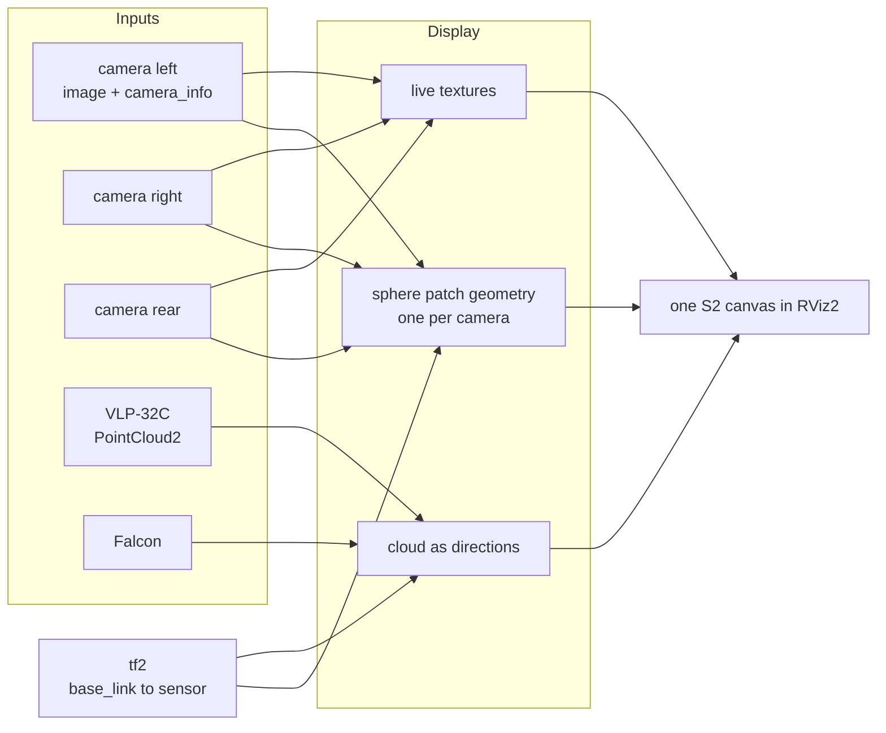
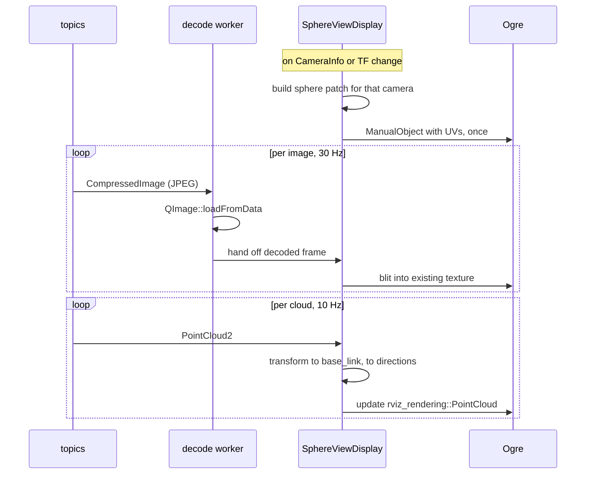
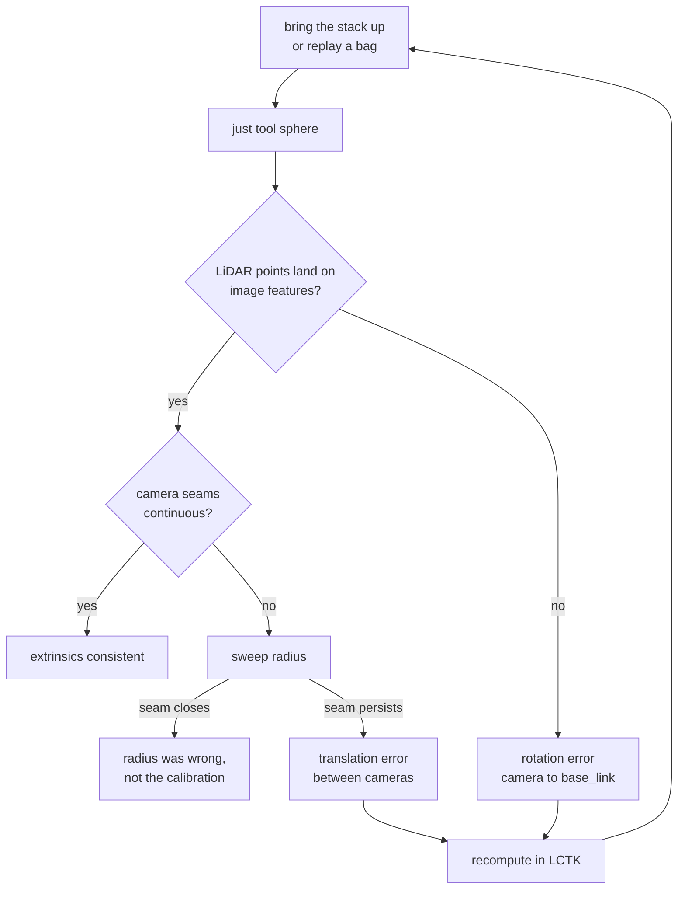

# Spherical Sensor View — design

A live RViz2 display that paints every camera image and every LiDAR return onto
one sphere centred on `base_link`, so that a wrong extrinsic becomes something
you can see rather than something you compute.

Status: proposed, 2026-08-24. Nothing implemented.

Related: [Phase 3A camera calibration](../roadmaps/3-indoor-a-camera-calibration.md),
which this tool is meant to verify.

---

## The idea

Every sensor on the vehicle measures directions. A camera pixel is a direction
plus a colour; a LiDAR return is a direction plus a range. If the extrinsics are
right, two sensors looking at the same physical feature report the **same
direction** from `base_link`. If an extrinsic is wrong, they disagree, and the
disagreement has a shape: a rotation error slides the whole image against the
cloud, a translation error slides near objects more than far ones.

Projecting everything onto one sphere makes that comparison direct. The check
needs no ground truth, no target, and no measurement — only the observation that
two sensors should agree.



---

## Architecture

One package, one RViz2 display plugin. No extra nodes: the display subscribes
directly, because a separate node would add a serialisation hop for image data
that is already the largest thing in the system.

```
golfcart_sphere_view/
  src/
    textured_patch.{hpp,cpp}     vendored from nobleo/rviz_satellite, Apache-2.0
    sphere_mesh.{hpp,cpp}        direction grid, camera patch extraction
    camera_layer.{hpp,cpp}       one camera: sub, decode, texture, patch
    cloud_layer.{hpp,cpp}        one LiDAR: sub, directions, colouring
    sphere_view_display.{hpp,cpp}  rviz_common::Display, owns the layers
  plugin_description.xml
```

### Why `rviz_common::Display` and not `RosTopicDisplay`

`RosTopicDisplay<T>` binds a display to exactly one topic. This tool needs three
images, three `CameraInfo`, and two clouds on one canvas, so it derives from
`Display` and manages its own subscriptions. This is the one structural place
where `rviz_satellite` cannot be followed — its `AerialMapDisplay` is
`RosTopicDisplay<NavSatFix>`.

### What comes from rviz_satellite

`tile_object.{hpp,cpp}` is 274 lines with no coupling to anything geographic: it
is a material, a dynamic texture fed from a `QImage`, and an
`Ogre::ManualObject`. Only its 23-line quad builder is specific to maps. Vendor
it as `textured_patch`, replace the quad builder with the sphere-patch builder,
keep the material configuration — `createMaterialWithNoLighting`,
`CULL_NONE`, depth-write off — which is already what a sphere viewed from inside
needs.

One change on the way in: `TileObject::updateData` destroys and recreates the
Ogre texture on every update. That is fine for map tiles, which change when the
vehicle drives a block. Three cameras at 30 Hz would make ninety texture
allocations a second. Create the texture once with `createManual` and blit into
its `HardwarePixelBuffer` afterwards.

---

## The geometry, and the one honest limitation

The sphere is a fixed direction grid — latitude/longitude, roughly 1° spacing —
centred on `base_link`. For each camera, each grid direction is transformed into
the camera's optical frame, kept if it is in front of the image plane, projected
through `K` and the distortion model, and kept if it lands inside the image.
Surviving vertices carry the texture coordinate; triangles with three surviving
vertices form that camera's patch.

**This geometry is a function of `CameraInfo` and TF only.** Both are static
while the vehicle runs, so the patches are built once and rebuilt only when
either changes. Per frame, nothing happens except a texture upload. That is what
makes a live tool affordable.

### Radius is not a cosmetic setting

A sphere has one radius; the world does not. A camera ray is painted onto the
sphere at radius `R`, which is exactly correct only for scene features actually
at distance `R`. Nearer or farther features land in the wrong place, and two
cameras with different centres disagree about *where* — the seam between them
opens up.

This is the bowl-model problem from surround-view stitching, and it is a real
limitation, not a bug to fix later. Three consequences:

1. **Radius must be a live property**, adjustable while watching. Sweeping it is
   informative: features align when `R` matches their true depth, which is a
   crude depth read-out and a good sanity check by itself.
2. **Rotation errors are visible at any radius.** They move everything in the
   same direction regardless of depth. This is what the tool is good at.
3. **Translation errors masquerade as radius errors.** A camera mounted 20 cm
   from where TF says it is looks like a scene at the wrong depth. Distinguishing
   the two needs the LiDAR, whose points carry true range.

A later refinement is an adaptive shell: use LiDAR range per direction instead of
a constant `R`. That removes the parallax entirely and turns the sphere into a
coarse depth map. It is deliberately out of scope for the first version, because
it couples the two sensor families the tool is supposed to compare independently.

### The two cloud modes

| Mode | Point placement | Answers |
|---|---|---|
| `angular` | snapped to radius `R` | Do camera and LiDAR agree on **direction**? Pure rotation test, parallax removed. |
| `metric` | true range | Where does the cloud actually sit relative to the painted image? Exposes translation, at the cost of the sphere no longer being a sphere. |

Start in `angular`. It answers the question the tool exists for, with no
confounds.

---

## Data flow



JPEG decoding must not happen on the render thread. The cameras publish
`image_raw/compressed` only, so every frame needs a decode; doing that inline
would stall RViz's frame loop. One worker thread per camera, with the newest
decoded frame handed over and older ones dropped — this is a monitor, so
dropping is correct.

---

## Inputs on this vehicle

| Layer | Topic | Frame |
|---|---|---|
| camera left | `/sensing/camera/left/image_raw/compressed` + `/camera_info` | `camera_left` |
| camera right | `/sensing/camera/right/image_raw/compressed` + `/camera_info` | `camera_right` |
| camera rear | `/sensing/camera/rear/image_raw/compressed` + `/camera_info` | `camera_rear` |
| ZED (orin) | `/sensing/camera/zed/rgb/color/rect/image/compressed` | `zed_left_camera_frame_optical` |
| VLP-32C | `/sensing/lidar/vlp32/velodyne_points` | `velodyne` |
| Falcon | `/sensing/lidar/falcon/iv_points` | `seyond` |

Cameras and their `camera_info` are configured, not hardcoded, so the same
display serves the ZED on the orin and the three GMSL cameras on the Advantech.

---

## Workflow



The tool is **read-only**. It does not estimate or write extrinsics; LCTK does
that. What this adds is the step before and after: seeing that a calibration is
wrong, and confirming that a new one is right.

A concrete first session, once phase 3A's calibration lands:

1. Park where the LiDAR sees structure with visual texture — a building edge, a
   doorway, parked cars.
2. Open the display with only `camera_left` and the VLP-32C enabled.
3. Set radius to roughly the distance of that structure.
4. Look at whether the depth discontinuity in the cloud sits on the visual edge.
5. Enable `camera_right`; look at the seam.
6. Repeat for the rear camera and the Falcon.

---

## Phases

| Phase | Deliverable | Proves |
|---|---|---|
| S1 | `textured_patch` vendored, one hardcoded camera on a sphere patch | the Ogre path works in RViz2 |
| S2 | configurable camera list, decode workers, live radius | three cameras and their seams |
| S3 | cloud layers, `angular` and `metric` modes, colour by intensity or range | the actual check |
| S4 | `just tool sphere` recipe, saved RViz config, docs | somebody else can run it |

S1 is the risk: if dynamic textures on `ManualObject` geometry misbehave inside
RViz2's render loop, that is better found in a day than after the projection
maths is written.

---

## Risks

**The calibration this tool verifies is currently wrong in a way that will
dominate what it shows.** Phase 3A found one calibration cloned across three
cameras, at a resolution that does not match the declared one — a systematic
~14° bearing error. Built today, the tool would faithfully render nonsense.
That is an argument for building it, but the first honest picture needs 3A's
recalibration to land first.

**The distortion model must be applied exactly.** The camera files declare
`rational_polynomial` with all four rational coefficients zero and the
thin-prism terms carrying the values. Whatever the resolution of that, the
projection code has to use the same convention as the driver, or the tool
invents error that is not there. Reuse Autoware's
`autoware_image_projection_based_fusion` maths rather than re-deriving it.

**Frame conventions.** Camera projection happens in the optical frame, and the
sensor kit has no `*_optical_link` frames — a known 3A blocker. Until those
exist, the transform chain is off by the body-to-optical rotation, and the tool
will show a ~90° error that is real but is in the URDF, not the calibration.

**Render thread stalls.** Covered above: decode off-thread, texture blit rather
than reallocate, geometry rebuilt only on `CameraInfo` or TF change.

---

## Alternatives considered

**RViz2's stock `Camera` display** renders the 3D scene composited onto a camera
image using `camera_info`, with an alpha slider. For a single camera against a
cloud it is the same check and costs nothing to try, and it should be the first
thing anybody does. What it cannot do is put several cameras and several LiDARs
in one angular frame, which is where inter-sensor disagreement lives.

**A node publishing an equirectangular panorama**, viewed with the stock `Image`
display. All of the projection maths, none of the Ogre. Cheaper to build and a
reasonable fallback if S1 goes badly; loses interactive navigation, and the
panorama's pole distortion makes vertical structure hard to judge. The maths is
shared, so this is a fallback rather than a different project.

**Textured `Marker`**: rejected. Marker textures come from `mesh_resource` and
material files on disk, which cannot be fed at frame rate.
