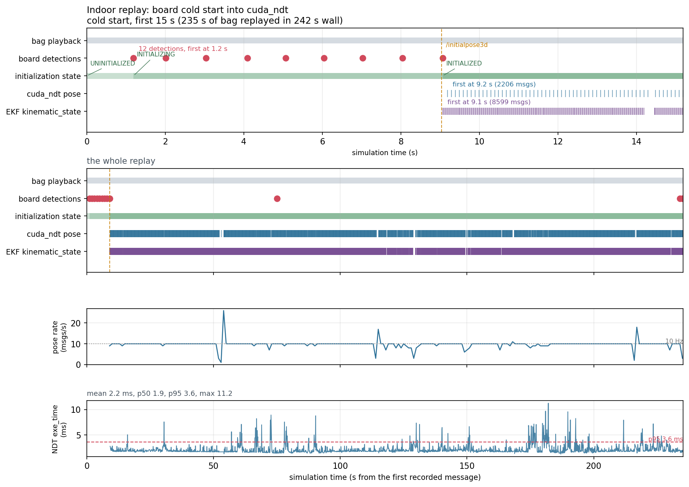

# Where the indoor replay spends its time

First measurement pass of the low-speed autonomy performance campaign, on the
2026-08-20 basement survey: `rosbags/basement/vlp32_1` replayed through
`indoor_logging_sim.launch.xml` against `data/basement-indoor`.

Host: 20 cores, x86_64, NVMe. 83 nodes (28 processes, 7 containers, 48
composables). Sampled for 63 s of a 235 s replay, `pose_source:=ndt`,
`pointcloud_backend:=cuda`, perception/planning/control off.

**The headline: nothing here is I/O bound, and the one process that dominates
CPU spends four fifths of it in the rclpy executor rather than on its own work.**

---

## What the replay costs

| | CPU | RSS | block I/O |
|---|---|---|---|
| `board_detector` | **120.9%** | 137 MB | 0 |
| `ndt_scan_matcher` | 11.8% | 170 MB | 0 |
| `pointcloud_container` | 9.1% | 284 MB | 0 |
| everything else (30 processes) | ~44% | ~5 GB | 0 |
| **total** | **185.7%** of a 2000% budget | 5.7 GB | **0.00 MB/s** |

Topic rates over the same window:

| topic | rate |
|---|---|
| `/sensing/lidar/vlp32/velodyne_points` | 10.00 Hz |
| `/sensing/lidar/concatenated/pointcloud` | **4.73 Hz** |
| `/localization/util/downsample/pointcloud` | 10.00 Hz |
| `/localization/pose_estimator/pose_with_covariance` | 9.94 Hz |
| `/localization/kinematic_state` | 39.91 Hz |

NDT's own `exe_time_ms`: n=292, mean 3.9 ms, p50 2.8, p95 9.1, max 29.0.

## I/O is not a bottleneck

The bag is one topic, 2354 `PointCloud2` messages over 235.3 s: 10 Hz,
**1.56 MB per scan, 15.6 MB/s**. Every process reported **0.00 MB/s** of
block-layer reads during the run, because 3.5 GB fits in page cache. The
figure that matters is not the disk, it is:

* **`ros2 bag play` holds 3.5 GB resident.** `indoor_sim_bag.sh` passes
  `--read-ahead-queue-size 5000`, and 5000 × 1.56 MB is 7.8 GB of headroom for
  a 3.5 GB bag, so it buffers the lot. Harmless on a 20-core workstation,
  reckless on the Orin, where the same replay would compete with the stack for
  memory. A few hundred messages is a second of read-ahead at this size.
* **12 of every 32 bytes are derived fields.** The cloud is `PointXYZIRCAEDT`:
  `azimuth`, `elevation` and `distance` are recomputable from x/y/z and cost
  37.5% of the bandwidth. Only `time_stamp` is needed for deskew. Publishing
  `PointXYZIRC` would halve the sensor path's bytes, for live runs rather than
  this bag.
* Fragmentation is a non-issue: at `MaxMessageSize 65500B` a scan is 24
  fragments, 240/s per subscriber.

## The board detector burns a core on the executor, not on detection

`board_detector` is 65% of all CPU used by the replay. It is **not** the
detector algorithm. cProfile over 45 s of steady state, inside the node:

| | tottime | share of wall |
|---|---|---|
| `rclpy/executors.py:516 _wait_for_ready_callbacks` | **36.3 s** | **81%** |
| `detector.py:221 _transform_points` | 2.8 s | 6% |
| `numpy vstack` (10-scan batch) | 0.7 s | 1.5% |
| `detect_board` (cumulative) | 3.8 s | 8.5% |
| `_on_cloud` (cumulative) | 4.9 s | 11% |

So the node's real work is about a tenth of a core; the rest is rclpy's
wait-set rebuild loop spinning. Three things follow, in the order worth trying:

1. **The executor spin is the target, not the algorithm.** Optimising
   `detect_board` cannot recover more than ~10% of that core. A C++ port of
   the node, or a coarser executor timeout, is where the 1.2 cores are.
2. **Transform after gating, not before.** `_transform_points` is 66 ms per
   batch because it transforms all 491,109 accumulated points. Detection then
   uses the retroreflective subset, which the same run logs as **816 points**.
   Gating on intensity before the transform is a ~500x smaller matrix multiply
   for identical output.
3. **The accumulation window sets the floor.** `accumulate_scans: 10` means one
   detection per second over 491k points; both costs above scale with it.

Measured for comparison, so they can be ruled out: rclpy deserialization of a
1.56 MB `PointCloud2` is **0.6 ms** (1% of a core at 10 Hz), and
`point_cloud2.read_points` is **0.2 ms** per scan. Neither is worth touching —
a hand-rolled `frombuffer` view measured *slower*, at 1.0 ms.

## The map path is healthy, and the "loader publishes nothing" was a missing file

`data/basement-indoor` had no `pointcloud_map.pcd`; only the YAML and OSM files
are tracked, and the 61 MB PCD lives on the NAS. With it copied in, the loader
publishes in **0.4 s**: 3,995,308 points, 63.9 MB, frame `map`.

Two traps worth writing down, because either one looks like "the loader emits
nothing":

* **A missing PCD is loud, not silent.** The node logs `No PCD was loaded` and
  aborts with `std::runtime_error` (exit -6). If the loader looked silent, it
  had already died.
* **`/map/pointcloud_map` is `transient_local` and published once.** A
  `ros2 topic echo` that joins afterwards with default (volatile) QoS waits
  forever, having missed the only message. Echo it with
  `--qos-durability transient_local`.

Nothing suggests the map path needs optimising for this map. NDT does not read
that topic at all: it pulls through `/map/get_differential_pointcloud_map`
(`map_radius: 150 m`, `update_distance: 20 m`), and `map_height_fitter` uses
the partial-load service. At runtime `map_container` costs 0.9% CPU and 120 MB.
`enable_whole_load: true` therefore buys one 64 MB sample that only RViz and
`compare_map_segmentation` would read, and perception is off in this replay —
worth turning off for headless replays, worth nothing for latency.

## The halved concatenator rate is a sync timeout, not compute

Measured per stage, CUDA backend (the default), 30 s windows:

| stage | rate | points |
|---|---|---|
| `vlp32/velodyne_points` (from the bag) | 10.03 Hz | 53,040 |
| `vlp32/pointcloud_before_sync` (after CUDA preprocessing) | **10.00 Hz** | 47,399 |
| `concatenated/pointcloud` | **4.47 Hz** | 47,399 |
| `falcon/iv_points` | **silent** | -- |

Preprocessing keeps the full rate, so nothing upstream is dropping frames, and
the concatenated cloud carries exactly the Velodyne's own points. The evidence
that decides it is lateness rather than rate: each concatenated cloud arrives
**p50 190 ms, max 240 ms** after its own header stamp, against a 100 ms scan
period. Compute-bound would be a fraction of a period; 190 ms is
`timeout_sec: 0.2`.

`input_topics` lists two LiDARs and this bag has one. Each cycle the
concatenator waits the full timeout for `/sensing/lidar/falcon/iv_points`,
publishes the Velodyne alone, and the scan that arrived during the wait is
dropped (`publish_previous_but_late_pointcloud: false`). One output per
timeout is ~5 Hz; 4.47 Hz measured.

Two A/B runs, same bag, same stack:

| `input_topics` | `timeout_sec` | concatenated | age p50 |
|---|---|---|---|
| falcon + vlp32 *(shipped)* | 0.2 | 4.47 Hz | 190 ms |
| **vlp32 only** | 0.2 | **silent** | -- |
| falcon + vlp32 | **0.05** | **10.00 Hz** | 139 ms |

**Removing the absent LiDAR is not the fix.** With one input the CUDA
concatenator publishes nothing at all, which is the "refuses a single input"
behaviour CLAUDE.md already warns about; it stays silent rather than passing
the cloud through. What restores the rate is a timeout shorter than the scan
period: at 0.05 s the missing Falcon costs one 50 ms wait per scan instead of
a dropped scan, and the output returns to 10.00 Hz. The residual 139 ms of age
is the rest of the chain (preprocessing plus transport, ~89-112 ms measured as
the floor in both runs).

This matters beyond replay. On the vehicle, with both LiDARs present, the
timeout only bites when the Falcon is late or drops out -- and then the
concatenated rate halves and everything downstream of it inherits 200 ms of
age, exactly as it does here. A timeout at 0.2 s on a 10 Hz sensor pair is a
choice to drop a scan rather than publish one sensor's cloud on time. Worth a
decision, not a silent default; this replay is not affected either way,
because `indoor_logging_sim.launch.xml` feeds NDT and the board detector the
raw topic directly and nothing consumes the concatenated cloud.

**What was changed, and what was not.** `timeout_sec` is now 0.05
(golfcart_sensor_kit_launch dfd066b): a collector must not wait longer than
one scan period, and the 0.2 s it replaces was introduced as a placeholder
(217719a, "matching_strategy is placeholder"). `input_topics` is unchanged --
this cart carries two LiDARs by design, and the single-input case is not
something the node can be configured into: upstream's answer to
[discussion #4700](https://github.com/orgs/autowarefoundation/discussions/4700)
is that a single-LiDAR system should not run this node at all and should let a
filter's `input_frame`/`output_frame` do the frame transform. Duplicating the
one topic to satisfy the node would double the cloud for nothing.

So a single-LiDAR replay still gets no concatenated cloud. That costs this
replay nothing, because `indoor_logging_sim.launch.xml` feeds NDT and the
board detector the raw topic and nothing consumes the concatenated output --
but any future single-LiDAR bag that does need it wants the node skipped, not
reconfigured.

## Open

Not yet measured: the same replay on the Orin, which is the machine that
matters, where 185% of CPU lands on a much smaller budget and the 3.5 GB
read-ahead competes with the stack.

## Reproducing

```bash
just indoor-test run rviz=off          # bag paused, stack, resume, hold
python3 scripts/performance/profile_replay.py --seconds 60
```

---

# The cold start, timed



Recorded 2026-09-12 with `scripts/performance/record_indoor_events.py` and drawn
by `plot_indoor_timeline.py`, from a full `just indoor-test run rviz=off` on the
defaults: basement Falcon map, vlp32 bag, board initializer, cuda_ndt. 235 s of
bag in 242 s wall, so the workstation replays this at 1.03x real time.

| event | sim time | wall |
|---|---|---|
| state UNINITIALIZED | 0.00 s | 4.1 s |
| **first board detection** | **1.19 s** | 8.4 s |
| state INITIALIZING | 1.19 s | 8.4 s |
| `/initialpose3d` published | 9.04 s | 16.2 s |
| state INITIALIZED | 9.07 s | 16.2 s |
| first cuda_ndt pose | 9.19 s | 16.4 s |
| first EKF `kinematic_state` | 9.10 s | 16.3 s |

**The cold start costs 7.9 s, and it is not the detector.** The detector had a
pose 1.19 s in, on its first batch, and the state machine moved to INITIALIZING
in the same instant. Everything after that is the initializer and the align:
eight more detections went by, one per second, before `/initialpose3d` appeared
at 9.04 s. One second of that is the detector's own accumulation window
(`accumulate_scans: 10` at 10 Hz); the other ~7 s is the align call.

That number is the one worth holding on to. CLAUDE.md recorded the cuda_ndt
align as ~23 s against the caller's deadline, which is why both logging sims
used to default to `ndt`. Here it returns inside 8 s and the initialization
completes. It has still not been measured on the Orin.

**Tracking, once started, is steady.** 2206 poses over 226 s is 9.76 Hz against
a 10 Hz input, with per-scan `exe_time_ms` of mean 2.15, p50 1.86, p95 3.61,
max 11.24. The rate panel shows the only interesting departures: single-second
dropouts to 1-3 Hz at sim 53, 114, 128 and 216 s, each paired with a catch-up
spike immediately after (26 Hz at 53 s). The largest gap between consecutive
poses is 0.97 s. Those are the frames to look at next; nothing in this run
explains them yet.

**One detection is in the wrong place, and it matters for a colder start.** Nine
of the twelve detections cluster at map position (11.5, -4.6) with 3 cm of
spread, which is the board. The tenth, at sim 75.02 s, reports (1.40, 3.26) --
ten metres away, while the vehicle is elsewhere in the basement. It cost
nothing here because the state machine had been INITIALIZED for 66 s and the
initializer ignores poses afterwards. Had the cart started from there, or had
the first nine detections been missed, that pose was available to seed
localization at a position that is not where the cart was. The detector's gates
let one through; the confidence attached to it is worth a look before the board
path is trusted on a route where the board is out of sight at start-up.
