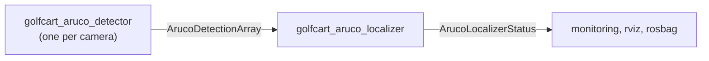

# aruco_detection_msgs

The contract between the ArUco detector and the ArUco localizer.

Deliberately **not** named `golfcart_*`: the detector that produces these
messages is vehicle-agnostic, and a message package that a general detector must
depend on should not carry a vehicle's name.

## `ArucoDetection`

One marker seen by one camera.

| field | meaning |
|---|---|
| `id` | dictionary id, unique per physical board |
| `corners_rectified[8]` | four corners as x,y pairs, in the **rectified** frame, ordered top-left, top-right, bottom-right, bottom-left |
| `pose_1`, `pose_2` | both planar solutions, best first |
| `reprojection_error_1`, `_2` | pixels, computed by the detector rather than taken from OpenCV |

Both poses travel because a square marker seen by one camera is genuinely
two-valued and nothing in that image resolves it. `error_1 / error_2` is the
ambiguity metric, in `(0, 1]`; it **rises** toward 1 as the marker becomes less
certain. An infinite `error_2` means only one distinct pose survived, which
correctly yields a ratio of 0 rather than a suspiciously perfect 1.

Corners are carried in full rather than as a bounding box because the localizer
solves jointly over corner reprojection error. An axis-aligned box loses all
rotation and perspective, and reconstructing corners from a centre and a size
gives biased correspondences for any non-fronto-parallel view.

## `ArucoDetectionArray`

Every marker one camera saw in one frame, plus `k`, the image size, and a header
carrying the **sensor stamp** and the camera's **optical** frame.

`k` travels with the detections so a recording replays without the camera. A
consumer that re-derived it from a live `CameraInfo` would silently use the wrong
intrinsics after a recalibration, and always the wrong ones on a replayed bag.

An empty array is meaningful and is published: "no markers in view" is how the
localizer tells a coverage gap from a detector that has stopped.

## `ArucoLocalizerStatus`

What the localizer did with a window and how much to trust it: state, degrees of
freedom solved, which boards were used, flagged and unmapped, the observability
metrics, and the dead-reckoning budget with elapsed time.

This is the human-readable channel. The machine-readable one is `/diagnostics`,
and only that can stop the vehicle.
