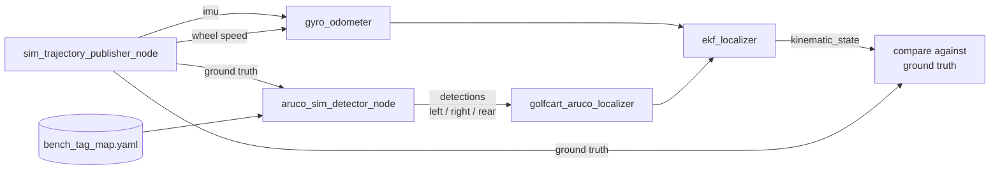

# aruco_sim_detector

Synthetic ArUco detections from a scripted trajectory. A test fixture, not part
of the vehicle.

It exists so the localizer, the EKF, the health states and the diagnostics graph
can be exercised end to end in seconds, without a camera, a map, a simulator or
a vehicle — and so faults that are hard to stage physically (a board knocked off
its mount, a total blackout, clock skew) can be injected on demand.



The detector publishes on **exactly the topics the real detectors use**, so
nothing downstream can tell the difference. That is the only way substituting it
proves anything about the real path.

## Nodes

**`sim_trajectory_publisher_node`** — ground truth pose, plus the IMU and wheel
speed the EKF needs. Without those the fused pose never moves between ArUco
fixes and the dead-reckoning states cannot be exercised at all. Gyro noise and
bias are on by default: a dead-reckoning chain fed perfect rates does not drift,
which would make `DEAD_RECKONING` look survivable for far longer than it is.

Patterns: `static`, `straight` (out and back, **reversing** rather than turning),
`circle`, `corridor` (straight, 90° turn, straight; clamped at the end rather
than wrapping).

**`aruco_sim_detector_node`** — projects the tag map through each camera, applies
visibility gates, adds Gaussian corner noise, and runs the same PnP the real
detector runs.

### Fault injection

| parameter | injects |
|---|---|
| `fault.blackout` + `fault.blackout_start_s` | stop emitting detections after N seconds. Blacking out from t=0 tests nothing — with no first fix there is nothing to dead-reckon from. |
| `fault.displaced_board_id` + `fault.displacement` | move one board off its map entry. Displacing by zero is not a fault. |
| `fault.visible_board_ids` | restrict what may be seen: one board exercises `DEGRADED`, boards on one wall exercise the coplanar flip tie |
| `fault.stamp_offset_s` | push stamps into the future, for clock-skew rejection |

## Usage

Detector and trajectory alone:

```bash
ros2 launch aruco_sim_detector bench_sim.launch.xml
```

The whole localization stack against it — this is the useful one:

```bash
ros2 launch golfcart_launch sim_smoke.launch.xml pattern:=corridor
python3 scripts/check/aruco_smoke_test.py            # 6 graded scenarios
python3 scripts/check/aruco_smoke_test.py --list
```

## What it cannot tell you

The simulator shares its camera model, tag map and geometry conventions with the
localizer, so a consistent error in any of them cancels out and passes. Real lens
distortion, detection rate under real lighting and motion blur, exposure
behaviour, CPU cost on the Orin, and whether a board layout delivers its assumed
coverage all need recorded bags. Passing here means the software is coherent, not
that the system works.

15 tests, covering the projection round trip and the OpenCV PnP workaround.
