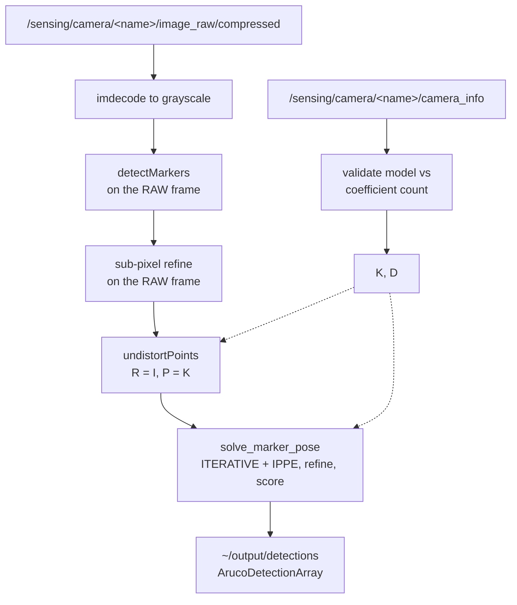

# golfcart_aruco_detector

Images in, rectified marker corners and both candidate poses out. One node per
camera. Knows nothing about the map, TF or the vehicle — it reports what a camera
saw and how confident it is, and [`golfcart_aruco_localizer`](../golfcart_aruco_localizer)
turns that into a vehicle pose.

Vendored from [LCTK](https://github.com/NEWSLabNTU/LCTK) (`aruco-config`,
`aruco-detector`, `aruco-locator`, `aruco_locator_node`) and merged into one
package. LCTK keeps its own copy for camera–LiDAR calibration; the two are
expected to diverge, because they want different things.

## The pipeline inside one node



**Do not rearrange the middle four steps.** Detection and refinement run on the
unresampled sensor image because `undistort` resamples bilinearly and blunts
exactly the gradients sub-pixel refinement reads. The corners are then mapped
into the rectified frame, so the PnP that follows must pass **zero** distortion —
passing `D` again double-corrects, which LCTK measured at 40 px of displacement
on a ~900 px image.

## Two things that look wrong and are not

**`solve_marker_pose` does not simply call `solvePnPGeneric(SOLVEPNP_IPPE_SQUARE)`.**
On OpenCV 4.5.4 that returns poses which do not reproject — measured on noiseless
synthetic corners, where the correct answer reprojects to zero by construction,
the *better* of its two solutions was 115 px out viewed fronto-parallel and
2.84 px out at 0.5 rad tilt. `estimatePoseSingleMarkers` looks fine only because
on this version it quietly uses `SOLVEPNP_ITERATIVE`. So candidates are seeded
from both methods, polished with `solvePnPRefineLM`, and scored with our own
reprojection error. Simplifying this back to the obvious call fails
`tests/pose_contract.rs`.

**The ambiguity ratio does not flag fronto-parallel views.** Measured with 0.3 px
corner noise on a 0.384 m marker at 3 m:

| tilt | 0° | 5° | 10° | 15° | 25° | 45° | 75° |
|---|---|---|---|---|---|---|---|
| median ratio | 0.000 | 0.000 | 0.000 | 0.046 | 0.029 | 0.016 | 0.013 |
| rotation error | 1.45° | 1.01° | 0.65° | 0.44° | 0.28° | 0.19° | 0.14° |

Rotation error is worst looking straight at a marker and improves as it tilts,
but the ratio does not track that: below ~10° of tilt it reports 0 — maximum
confidence — precisely where orientation is least reliable, because the twin
solution is not yet distinct enough to act as a rival. It is a **resolution**
gate, not a **geometry** gate. The localizer's `min_view_angle_deg` is what
excludes those views, and the two are not interchangeable.

## Interface

| direction | topic | type |
|---|---|---|
| in | `~/input/image/compressed` | `sensor_msgs/CompressedImage` |
| in | `~/input/image` | `sensor_msgs/Image` (only when `use_compressed:=false`) |
| in | `~/input/camera_info` | `sensor_msgs/CameraInfo` |
| out | `~/output/detections` | `aruco_detection_msgs/ArucoDetectionArray` |
| out | `~/output/overlay` | `sensor_msgs/Image` (only when `debug_overlay:=true`) |

Detections are published **even when empty** — "no markers in view" is
information the localizer needs to tell a coverage gap from a detector that has
stopped running.

### Parameters

Full set with rationale in
[`golfcart_launch/config/localization/aruco_detector.param.yaml`](../../launcher/golfcart_launch/config/localization/aruco_detector.param.yaml).

The config and launch files live in `golfcart_launch`, not here. This package
is built with `ament_cargo`, which installs the compiled binary and nothing
else — a `config/` or `launch/` directory inside it never reaches `install/`,
and the node then runs on its compiled-in defaults while launch prints a
warning that is easy to miss. `golfcart_vehicle_interface` keeps its
parameters in `golfcart_vehicle_launch` for the same reason.

The parameters worth knowing:

| parameter | default | note |
|---|---|---|
| `dictionary` | `DICT_5X5_1000` | |
| `marker_size` | `0.384` | Side of the **black square**, not the printed board. The board has a white quiet zone that is not part of the marker; getting this wrong scales every reported range linearly. |
| `use_compressed` | `true` | gmslcam publishes compressed only. A detector on the raw topic waits forever and looks like a camera that sees nothing. |
| `corner_refinement` | `subpix` | OpenCV's default is none, which quantises corners to the pixel grid. Corner error is the direct input noise of the pose solve. |
| `error_correction_rate` | `0.6` | Deliberately not raised: a false ID is associated to a real surveyed board pose and yields a confident wrong answer, which is worse than a missed marker. |

## Usage

Standalone, one camera:

```bash
ros2 launch golfcart_launch aruco_detector.launch.xml \
  camera_name:=left \
  image_topic:=/sensing/camera/left/image_raw/compressed \
  camera_info_topic:=/sensing/camera/left/camera_info
```

Three cameras are brought up automatically by the localization component when
`pose_source:=aruco`; see the [localizer README](../golfcart_aruco_localizer/README.md).

Watch what it produces:

```bash
ros2 topic echo /sensing/camera/left/aruco_detections --field detections[0].id
ros2 topic hz /sensing/camera/left/aruco_detections
```

Nothing coming out? In order of likelihood: no `CameraInfo` yet (the node says
so, throttled); the camera publishes only compressed and `use_compressed` was
set false; the marker is outside the perimeter filter because it is small and
far; the dictionary does not match the printed boards.

## Tests

```bash
colcon build --base-paths src --packages-select golfcart_aruco_detector
cd src/localization/golfcart_aruco_detector && cargo test --release
```

28 tests. `tests/detection_contract.rs` covers the distort → detect → undistort
round trip, refinement actually running, 12-coefficient `rational_polynomial`
handling, and corner ordering. `tests/pose_contract.rs` covers the PnP.

Both fail loudly if the sequence above is "tidied".
