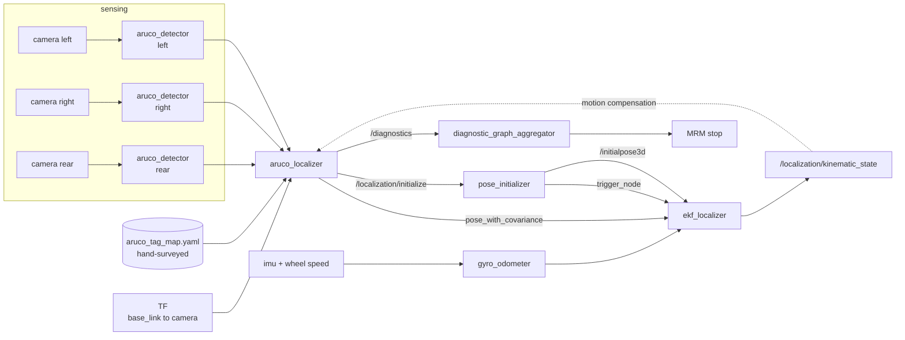
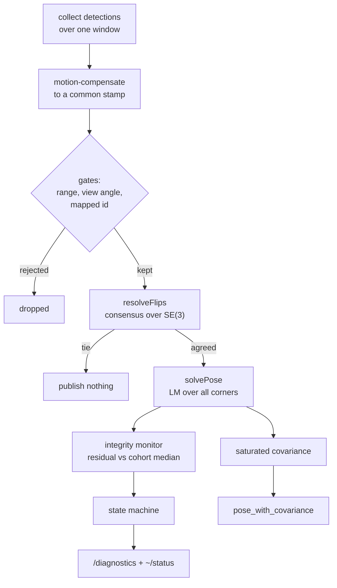

# golfcart_aruco_localizer

Marker detections from every camera in, one vehicle pose out. This is the sole
pose source when `pose_source:=aruco` — there is no scan matcher behind it and no
point cloud map, so when it stops the vehicle has nothing else.

## Where it sits



Publishing `/initialpose3d` does **not** initialize Autoware — `pose_initializer`
publishes that topic, it does not listen to it. Initialization goes through the
`/localization/initialize` service, and `pose_initializer` is what then calls the
EKF's `trigger_node` to bring it out of its dormant state.

## How one solve works



Two markers is the minimum for 6-DoF, and **not because of the count** — a single
marker's orientation is two-valued and nothing in one image resolves it. Two
markers with *different normals* resolve it by agreement, with no prior. Two
markers with the *same* normal do not: coplanar boards flip together, so their
wrong solutions agree exactly as well as their right ones. That is why
`min_normal_spread_deg` exists alongside `min_markers_for_6dof`.

## Interface

| direction | topic / service | type |
|---|---|---|
| in | `~/input/detections/<camera>` | `aruco_detection_msgs/ArucoDetectionArray` |
| in | `~/input/kinematic_state` | `nav_msgs/Odometry` (motion compensation only) |
| out | `~/output/pose_with_covariance` | `geometry_msgs/PoseWithCovarianceStamped` |
| out | `~/status` | `aruco_detection_msgs/ArucoLocalizerStatus` |
| out | `~/debug/mapped_tags` | `visualization_msgs/MarkerArray` (latched) |
| out | `/diagnostics` | `diagnostic_msgs/DiagnosticArray` |
| calls | `/localization/initialize` | `autoware_localization_msgs/InitializeLocalization` |

`~/status` is for humans; `/diagnostics` is the machine interface and the only
one that can stop the vehicle.

### States

| state | meaning | level |
|---|---|---|
| `UNINITIALIZED` | no first fix yet. Not dead reckoning — there is nothing to reckon *from*. | WARN |
| `NOMINAL` | ≥2 boards agreeing with enough normal spread | OK |
| `DEGRADED` | one board, or normals too alike. Position corrected, heading on the gyro. | WARN |
| `DEAD_RECKONING` | no usable boards. Budget counting down. | WARN |
| `FAULT` | budget expired, or integrity could not isolate. Latched; requests MRM. | ERROR |

`DEGRADED` and in-budget `DEAD_RECKONING` are deliberately WARN: the vehicle is
designed to drive through them, and escalating would trip an MRM for working
geometry.

### The tag map

```yaml
frame_id: map
survey:
  date: "2026-08-12"
  method: "tape measure"
  stated_accuracy: 0.02     # the ceiling on everything downstream
defaults:
  dictionary: DICT_5X5_1000
  marker_size: 0.384
tags:
  - id: 100
    position: {x: 3.0, y: 3.0, z: 1.5}
    orientation: {x: 0.5, y: -0.5, z: -0.5, w: 0.5}
  - id: 200                  # or give four surveyed corners instead
    corners:
      - [3.192, -3.0, 1.692]
      - [2.808, -3.0, 1.692]
      - [2.808, -3.0, 1.308]
      - [3.192, -3.0, 1.308]
```

The loader hard-errors on duplicate ids, non-planar corners, non-unit
quaternions and a missing `stated_accuracy`. See
[`config/example_tag_map.yaml`](config/example_tag_map.yaml).

**Board layout is a correctness concern, not a quality one.** A board flat on a
wall is only usable over a narrow band of the drive — viewing angle is
`acos(offset / range)`, so with a 3 m offset it passes through the usable
25–75° window while roughly 2–7 m away. Two boards must satisfy that *at the same
moment, with different normals*. Boards staggered along one wall never do; facing
pairs at equal offset do. And corners are where coverage fails: a layout planned
by walking the straights will have a hole exactly where the vehicle turns.

## Usage

Whole vehicle:

```bash
just launch "pose_source:=aruco aruco_tag_map_path:=./data/huaxia-campus/aruco_tag_map.yaml"
```

Whole stack against synthetic detections — no map, no simulator, runs in seconds:

```bash
ros2 launch golfcart_launch sim_smoke.launch.xml pattern:=circle
python3 scripts/check/aruco_smoke_test.py          # 6 graded scenarios
```

Watch it:

```bash
ros2 topic echo /localization/pose_estimator/aruco_localizer/status
ros2 topic echo /diagnostics --field status[0].message
```

Not producing a pose? The node says why, throttled: too few boards inside the
initialization gates, normals too alike, or an ill-conditioned constellation. If
it initialized but nothing downstream moves, check `pose_initializer` is running
— without it the EKF stays dormant forever.

### Parameters

40, with rationale, in
[`config/aruco_localizer.param.yaml`](config/aruco_localizer.param.yaml). The ones
that change behaviour most:

| parameter | default | note |
|---|---|---|
| `tag_map_path` | — | Required. No map is not a degraded localizer, it is a silent one. |
| `max_range` | `8.0` | Set by where the ambiguity gate stops keeping flipped boards out, not by where the detector stops seeing them. Measured: 0.14 % flipped-among-passing at 8 m, 2.3 % at 9 m, 24 % at 13 m. |
| `min_view_angle_deg` / `max_view_angle_deg` | `25` / `75` | Below the lower bound the pose is fronto-parallel and its orientation is untrustworthy; above the upper one detection fails. |
| `corner_sigma_px` | `0.3` | **Inferred, not measured.** The whole covariance model scales on it. Phase 3D-7 replaces it. |
| `dead_reckoning_budget_s` | `3.0` | Placeholder. Must follow from measured gyro drift against an allowable position error. |

## Tests

```bash
colcon build --base-paths src --packages-select golfcart_aruco_localizer
colcon test --base-paths src --packages-select golfcart_aruco_localizer
```

69 tests over the tag frame, map loader, solver and health logic — including that
a systematic fault flags nobody, that excluding one bad board is not a fault, and
that consensus admits noise-level disagreement while rejecting flip-level.
